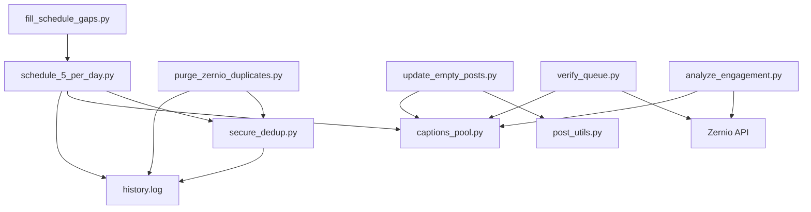

# GalaxyCoils Zernio — Project Wiki

> [!info] Overview
> Automated social media scheduling pipeline for GalaxyCoils Instagram. Uses Pexels drone footage, Zernio CLI for post management, and a multi-layered dedup system.

---

## Architecture



## Core Scripts

| Script | Purpose | Flags |
|---|---|---|
| `schedule_5_per_day.py` | Schedule 5 posts/day at 10/13/16/19/22 UTC | `--dry-run`, `--help` |
| `fill_schedule_gaps.py` | Fill up to 10 open schedule slots | `--dry-run`, `--help` |
| `purge_zernio_duplicates.py` | Delete duplicate scheduled posts | `--dry-run`, `--help` |
| `update_empty_posts.py` | Fix *excess* empty captions (mix-protected) | `--dry-run`, `--min-empty N`, `--max-empty-ratio R`, `--target-ratio R` |
| `verify_queue.py` | Queue health; **exits 1 on duplicates/overlap** | `--no-fail` |
| `analyze_engagement.py` | ER/views by caption category → MD + JSON reports | `--limit N` |

`scripts/captions_pool.py` owns the caption pools **and** `classify_caption()` — the single classifier used by verify + analytics, so reporting always matches what `generate_caption_plan()` produced.

## Testing

| Suite | Tests | Coverage |
|---|---|---|
| `test_secure_dedup` | 30 | history, extract, record, fetch helpers, repo-relative BASE_DIR |
| `test_post_utils` | 15 | `create_post`: draft, scheduled, ValueError, retry |
| `test_purge_dedup` | 10 | Dedup: oldest-first, intra-queue, history, dry-run |
| `test_fill_gaps` | 8 | Gap fill: no-slots, dry-run, success, cap, RuntimeError |
| `test_schedule` | 49 | video choice, caption plan, slots (incl. ISO formats), Pexels retry, main |
| `test_verify_queue` | 9 | health gate exit codes, mix reporting, per-day |
| `test_captions_pool` | 13 | classifier/pool integrity, edge cases |
| `test_analyze_engagement` | 14 | summarize math, reports, main paths, fetch |
| `test_update_empty` | 31 | ratio guard, find/fix/dry-run/main paths |
| **Total** | **179** | **99% line + branch on operational modules** |

One-off May-2026 recovery scripts (`batch_recover`, `chunk_recover`, `recover_rebuild`, `rebuild_viral_queue`) are excluded from the coverage gate — they ran once against a local backup manifest and are kept for reference only.

## Quality Gate (CI + pre-push)

`make full-audit` = syntax (all .py, auto-discovered) + queue verify + **ruff** + **mypy** + 179 tests + **coverage ≥ 95%**.

Setup: `pip install -r requirements-dev.txt`. Config lives in `pyproject.toml`.

## CI/CD Pipeline

- **Public repo** — `github.com/galaxycoils/galaxycoilszernio`
- **`.git/hooks/pre-push`** → Runs `make full-audit` before every push
- **`.github/workflows/ci.yml`** → GitHub Actions on push/PR to master (Python 3.12)
- **`.github/workflows/daily.yml`** → Daily 09:30 UTC queue top-up (see below)
- **Branch protection** → `audit` status check required, strict mode, enforce admins
- **Ruleset** → `Require CI to pass` (ID 16669262), active on `refs/heads/master`

## Daily automation

`daily.yml` keeps the queue full with zero manual intervention. One-time setup:

1. Add secret `PEXELS_API_KEY`.
2. Ensure the zernio CLI can auth non-interactively in Actions (`npm install -g zernio` + token/config).
3. Set repo variable `ENABLE_AUTOSCHEDULE=true`. Until then the workflow only dry-runs and reports queue health.

## Quick Reference

```bash
make help              # Show all commands
make schedule          # Schedule 5 posts/day
make schedule-dry      # Preview scheduling
make verify            # Queue health check (fails on unhealthy)
make test              # Run all 179 tests
make coverage          # Tests + coverage report (95% gate)
make lint              # Ruff
make typecheck         # Mypy
make full-audit        # The whole gate
make dedup-dry         # Preview duplicates
make empties-dry       # Preview excess empty-caption fixes
```

## Design Decisions

- **history.log** is the canonical source of truth for seen Pexels IDs; `secure_dedup.py` resolves it repo-relative, so it works on any machine
- **~30% empty captions** are intentional — engagement pivot (PLAN.md)
- **`update_empty_posts.py` is mix-protected** — only fixes empties beyond 35% of the queue, back down to 30%
- **`purge_zernio_duplicates.py`** uses `load_history()` only (not published posts) to avoid false positives
- **`.env`** stores `PEXELS_API_KEY` (auto-loaded at startup, gitignored; see `.env.example`)
- No hardcoded secrets in any source file

## See Also

- [[PERFECTION]] — daily perfection-review tracker (4 phases)
- [[GalaxyCoils Memory]] — Persistent project memory
- [[Zernio CLI Learnings]] — Zernio API quirks and patterns
- [[Queue State]] — Current queue health snapshot
