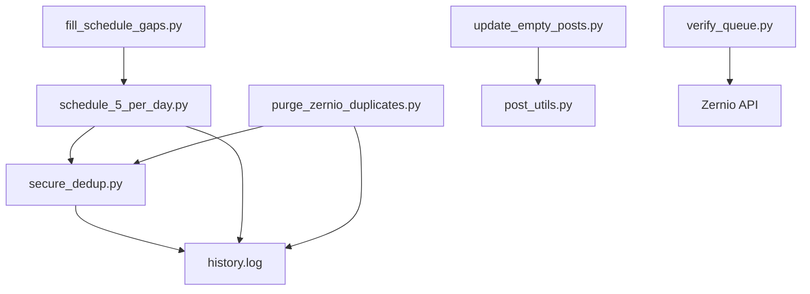

# GalaxyCoils Zernio — Project Wiki

> [!info] Overview
> Automated social media scheduling pipeline for GalaxyCoils Instagram. Uses Pexels drone footage, Zernio CLI for post management, and a multi-layered dedup system.

---

## Architecture



## Core Scripts

| Script | Purpose | Flags |
|---|---|---|
| `schedule_5_per_day.py` | Schedule 5 posts/day at 10/13/16/19/22 UTC | `--dry-run`, `--help` |
| `fill_schedule_gaps.py` | Fill up to 10 open schedule slots | `--dry-run`, `--help` |
| `purge_zernio_duplicates.py` | Delete duplicate scheduled posts | `--dry-run`, `--help` |
| `update_empty_posts.py` | Fix empty-caption posts | `--dry-run`, `--min-empty N` |
| `verify_queue.py` | Queue health: totals, per-day, duplicates | (none) |

## Testing

| Suite | Tests | Coverage |
|---|---|---|
| `test_secure_dedup` | 18 | `load_history`, `extract_id`, `record_scheduled` |
| `test_post_utils` | 15 | `create_post`: draft, scheduled, ValueError, retry |
| `test_purge_dedup` | 10 | Dedup: oldest-first, intra-queue, history, dry-run |
| `test_fill_gaps` | 8 | Gap fill: no-slots, dry-run, success, cap, RuntimeError |
| **Total** | **51** | |

## CI/CD Pipeline

- **`.git/hooks/pre-push`** → Runs `make full-audit` before every push
- **`.github/workflows/ci.yml`** → GitHub Actions on push/PR to main/master

## Quick Reference

```bash
make help              # Show all commands
make schedule          # Schedule 5 posts/day
make schedule-dry      # Preview scheduling
make verify            # Queue health check
make test              # Run all 51 tests
make full-audit        # Syntax + verify + 51 tests
make dedup-dry         # Preview duplicates
make empties-dry       # Preview empty captions (threshold 3)
```

## Design Decisions

- **history.log** is the canonical source of truth for seen Pexels IDs
- **53% empty captions** are intentional — part of `generate_caption_plan()`'s content mix
- **`--min-empty 3`** tolerates the ~3 intended empty posts from the caption plan
- **`purge_zernio_duplicates.py`** uses `load_history()` only (not published posts) to avoid false positives
- All scripts use `argparse` for consistent CLI experience

## See Also

- [[GalaxyCoils Memory]] — Persistent project memory
- [[Zernio CLI Learnings]] — Zernio API quirks and patterns
- [[Queue State]] — Current queue health snapshot
